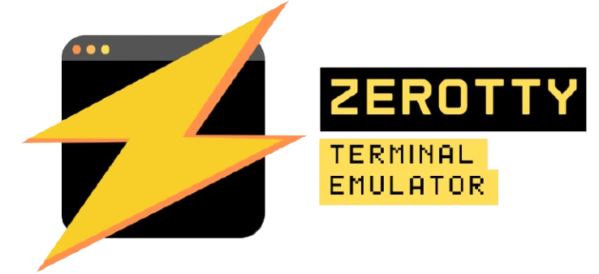

<div align="center">
  
  <h1>ZeroTTY</h1>
  <p>
    <b>A high-performance, cross-platform terminal emulator built with Zig.</b>
  </p>
  <p>
    <a href="https://github.com/PaNDa2code/zerotty/actions/workflows/test.yml"></a>
    <a href="https://github.com/PaNDa2code/zerotty/actions/workflows/test.yml"></a>
  </p>
</div>

ZeroTTY is a modern terminal emulator designed for speed, efficiency, and cross-platform compatibility. By leveraging the power of Zig and a low-level design, ZeroTTY aims to provide a native, high-performance experience with minimal dependencies.

> **⚠️ This project is currently in an early stage of development.  
> Expect bugs, missing features, and fast-moving changes**

## Features

*   **Cross-Platform:** Runs on Linux, Windows, and macOS.
*   **Multiple Renderer Backends:** Supports Vulkan and OpenGL.
*   **High Performance:** Built for speed and low resource usage.
*   **Customizable:** Configure fonts, colors, and more.
*   **Minimal Dependencies:** A lightweight and focused design.

## Getting Started

### Prerequisites

*   **Zig:** The project is built using the Zig compiler.
*   **System Libraries:** Additional system libraries may be required depending on your OS, chosen windowing system, and rendering backend (e.g., `X11`, `xcb`, `xkbcommon`, `GL` for Linux).

### Building from Source

1.  **Clone the repository:**

```bash
git clone https://github.com/PaNDa2code/zerotty.git
cd zerotty
```

2.  **Build the project:**

You can build ZeroTTY with the following command:

```bash
zig build -Doptimize=ReleaseSafe
```
This will build it with the recommend options for your setup.

You can also specify the rendering backend:

```bash
# Build with OpenGL renderer
zig build -Doptimize=ReleaseSafe -Drender-backend=OpenGL

# Build with Vulkan renderer
zig build -Doptimize=ReleaseSafe -Drender-backend=Vulkan
```

Also the window backend:
```bash
zig build -Dwindow-system=GLFW
```

3.  **Run ZeroTTY:**

After a successful build, the executable will be located in the `zig-out/bin` directory.

```bash
./zig-out/bin/zerotty
```

## Contributing

Contributions are welcome! If you'd like to contribute to ZeroTTY, please follow these steps:

1.  Fork the repository.
2.  Create a new branch for your feature or bug fix.
3.  Make your changes and commit them with a clear and descriptive message.
4.  Push your changes to your fork.
5.  Submit a pull request to the `master` branch of the original repository.

## License

This project is under MIT license.
