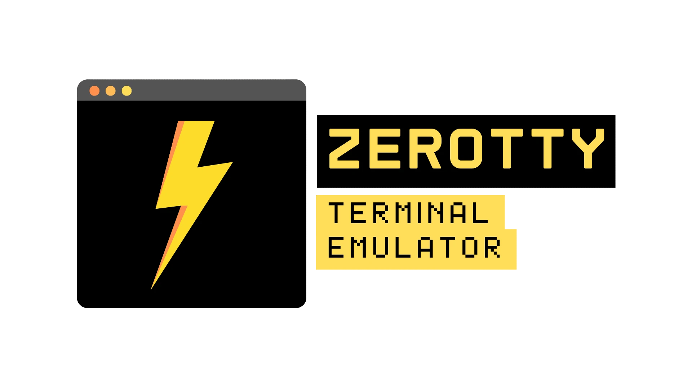

# ZeroTTY - A Cross-Compiled Terminal Emulator

## Description
ZeroTTY is a terminal emulator project. It focuses on **cross-compilation**, **native execution**, and **low-level design** to achieve high **speed and performance** across various operating systems.

